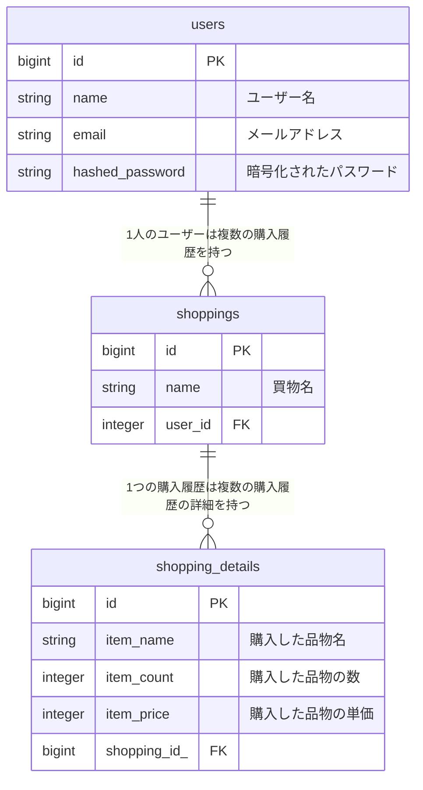

```mermaid
erDiagram
 users ||--o{ shoppings : "1人のユーザーは複数の購入履歴を持つ"
 users {
   bigint id PK
   string name "ユーザー名"
   string email "メールアドレス"
   string hashed_password "暗号化されたパスワード"
 }
 shoppings ||--o{ shopping_details : "1つの購入履歴は複数の購入履歴の詳細を持つ"
 shoppings{
   bigint id PK
   string name "買物名"
   integer user_id FK
 }
 shopping_details {
   bigint id PK
   string item_name "購入した品物名"
   integer item_count "購入した品物の数"
   integer item_price "購入した品物の単価"
   bigint shopping_id_ FK
 }
```
