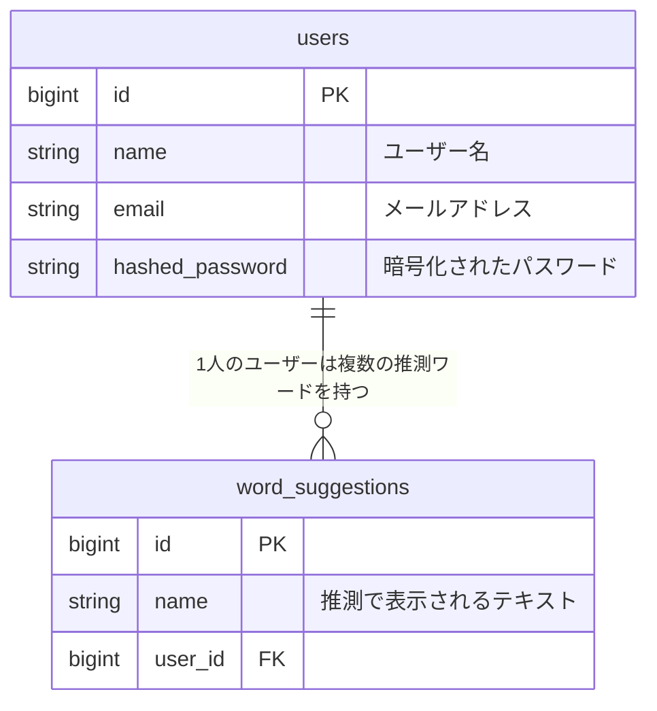

```mermaid
erDiagram
 users ||--o{ word_suggestions : "1人のユーザーは複数の推測ワードを持つ"
 users {
   bigint id PK
   string name "ユーザー名"
   string email "メールアドレス"
   string hashed_password "暗号化されたパスワード"
 }
 word_suggestions {
  bigint id PK
  string name "推測で表示されるテキスト"
  bigint user_id FK
 }
```
